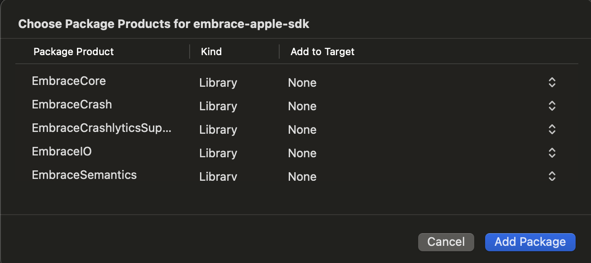

## Getting Started

This document will walk you through the Embrace BrandGame example app and what this app does to integrate
with the EmbraceIO package. The BrandGame app is a simple SwiftUI app that contains various examples
of an app using the Embrace SDK.

> [!NOTE]
> Triple tap the background to bring up the main menu!
> Otherwise the app will seem pretty empty...


### Opening the BrandGame Example Project

The BrandGame Xcode project can be found at
[`Examples/BrandGame/BrandGame.xcodeproj`](./Examples/BrandGame/BrandGame.xcodeproj/). This is a great project to read through to get an idea of how the Embrace team would go about instrumenting
 an app.

### Defining the SPM Package dependency

The BrandGame example app has the luxury of being within the same repo as the EmbraceIO package. So in its
Xcode project settings, it defines an SPM package dependency locally using a relative path.

For your project, you'll want to add the Embrace Apple SDK package dependency in Xcode. Select `File > Add Package Dependencies...`
and enter the repository URL `https://github.com/embrace-io/embrace-apple-sdk.git` into the search bar.

Be sure to set the Dependency Rule to a recent release. When "Choose Package Products for embrace-apple-sdk" appears,
Xcode will add all libraries to your application by default. For the most straightforward installation, select
`EmbraceIO` to add to your application target. For all other package products, do not add these
to your target by selecting `None`.



---

**Explanation of Package Products**

Here's a quick summary of the 3 products this package contains:

1. **EmbraceIO** - This is the recommended product for quick
 integration. It provides a convenience layer over `EmbraceCore` to
 simplify the setup interface.
2. **EmbraceCore** - This is the main implementation of the Embrace SDK.
If you'd like to customize your integration, this product allows you to.
3. **EmbraceCrash** - This contains the Embrace Crash Reporter. We keep this
as a separate target for those apps that may not want crash reporting enabled,
or may want to use a separate crash reporter. It is included as a dependency of
`EmbraceIO`, but not `EmbraceCore`.
4. **EmbraceCrashlyticsSupport** - This product enables Crashlytics/Firebase as your primary crash reporter. Embrace will continue to mirror reports sent to Crashlytics, ensuring that data is still available in the Embrace Dashboard. This is an optional product for those who specifically need Crashlytics as their crash reporter but also want to leverage the Embrace Dashboard.
5. **EmbraceSemantics** - This module contains constants and attributes used internally to extend OTel Semantic Conventions.


### Initializing the Embrace Client

The BrandGame example app is a straightforward SwiftUI application. When deciding where to
initialize Embrace, we chose to override the App's `init` method.

We'll import `EmbraceIO` and call `Embrace.setup` with an `Embrace.Options` object.
Here is the logic in
[BrandGame/BrandGameApp.swift](./Examples/BrandGame/BrandGame/BrandGameApp.swift):

```swift
import EmbraceIO
import SwiftUI

struct BrandGameApp: App {
    init() {
        do {
            try Embrace
                .setup(options: embraceOptions)
                .start()
        } catch let e {
            print("Error starting Embrace \(e.localizedDescription)")
        }
    }
}
```

Once the Embrace client had been started, it is ready to be used to observe performance in your App.

### Customizing Embrace Options

In the example above we refer to a variable `embraceOptions`. This is an instance of `Embrace.Options` that
is used to customize the behavior of the SDK. The BrandGame app defines this as a computed property in an extension
in [`App+Embrace.swift`](./Examples/BrandGame/BrandGame/Embrace/App+Embrace.swift).

Separating the this computed property into its own extension allows us to use a conditional compilation block to
change our options between our build configurations (Debug/Release).

```swift
#if DEBUG
    var embraceOptions: Embrace.Options {
        return .init(
            appId: "d3buG",
            appGroupId: nil,
            logLevel: .debug
        )
    }
#else
    var embraceOptions: Embrace.Options {
        return .init(
            appId: "myApp",
            appGroupId: nil
        )
    }
#endif
```

### Access the Embrace client

The `setup` and `start` methods both return a non-optional instance of the `Embrace` class.
Feel free to store a reference to this object:
```swift
let embrace = try Embrace
                .setup(options: embraceOptions)
                .start()

// later on
embrace
  .buildSpan(name: "my-operation")
  .startSpan()
```

Once `setup` has succeeded, you can access the same instance via the static `Embrace.client`
property. It is important to note that this is an optional property, and will be `nil` if called
before `setup` or if `setup` fails.

```swift
try Embrace
    .setup(options: embraceOptions)
    .start()

// later on
Embrace.client?
  .buildSpan(name: "my-operation")
  .startSpan()
```

An example of this in the BrandGame app is in
 [`ReflexGameModel.swift`](./Examples/BrandGame/BrandGame/View/Menu/Minigames/Reflex/ReflexGameModel.swift).
 In the `buildSpan` method we record a span to measure a user's reflex time:
```swift
extension ReflexGameModel {
    private func buildSpan(startTime: Date) -> Span? {
        return Embrace.client?.buildSpan(name: "reflex-measure", type: .ux)
            .setStartTime(time: startTime)
            .startSpan()
    }
}
```
For convenience, we use the `Embrace.client` static accessor to build this span.

### Exporting Logs and Traces using OpenTelemetry

To export your app's logs and traces using the Embrace iOS SDK to the [OpenTelemetry Collector](https://opentelemetry.io/docs/collector/) or a backend of your choice, initialize your `Embrace.Options` with an [`OpenTelemetryExport`](./Sources/EmbraceCore/Public/OpenTelemetryExport.swift) object.

This object takes optional SpanExporters and LogExporters that point to your ingest points. Here are some example Exporter objects, initialized using HTTP endpoints that are specific to the OTel Collector or your chosen backend:

```swift
 private var otelSpanExporter: OtlpHttpTraceExporter {
        let configuration = URLSessionConfiguration.default
        let headerValue = // THIS VALUE IS COLLECTOR/BACKEND SPECIFIC
        configuration.httpAdditionalHeaders = ["Authorization": "Basic \(headerValue)"]
        let session = URLSession(configuration: configuration)

        return OtlpHttpTraceExporter(
            endpoint: URL(string: "https://otlp-gateway-prod-us-west-0.grafana.net/otlp/v1/traces")!,
            useSession: session
        )
    }

    private var otelLogExporter: OtlpHttpLogExporter {
        let configuration = URLSessionConfiguration.default
        let headerValue = //THIS VALUE IS COLLECTOR/BACKEND SPECIFIC
        configuration.httpAdditionalHeaders = ["Authorization": "Basic \(headerValue)"]
        let session = URLSession(configuration: configuration)

        return OtlpHttpLogExporter(
            endpoint: URL(string: "https://otlp-gateway-prod-us-west-0.grafana.net/otlp/v1/logs")!,
            useSession: session
        )
    }
```

Once these objects have been created, you can initialize the `Embrace.Options` with a `OpenTelemetryExport` that contains one, both, or neither of these Exporters:

```swift
 var embraceOptions: Embrace.Options {
        return .init(
            appId: APP_ID,
            appGroupId: nil,
            platform: .default,
            endpoints: Embrace.Endpoints.fromInfoPlist(),
            export: OpenTelemetryExport(
                spanExporter: otelSpanExporter,
                logExporter: otelLogExporter
            )
        )
    }
```

### Symbolicating Crash Reports

In order to have stack traces in error logs or crashes be as readable as possible, its important to upload
 your app's desymbolication files to the Embrace backend. The best way to do this is to add a build step
 to your project.

First, download [our support utility](https://downloads.embrace.io/embrace_support.zip).
This is an archive that contains the Embrace `embrace_symbol_upload` binary and also a shell script `run.sh`.
These should be copied into your project at a known location like `embrace_support/embrace_symbol_upload.darwin`
and `embrace_support/run.sh`.

Then, in your app target's Xcode Build Phases pane, add a new 'Run Script Phase' at the end of the list
of Build Phases. This run script phase should invoke the `run.sh` script with the envvars `EMBRACE_ID`
and `EMBRACE_TOKEN`:

```sh
EMBRACE_ID='USE_YOUR_KEY' EMBRACE_TOKEN='USE_YOUR_TOKEN' "path/to/run.sh"
```

These envvars are retrieved from your Embrace dashboard and are:
- **EMBRACE_ID** The 'appId' value you have configured in `Embrace.Options`
- **EMBRACE_TOKEN** A secret token that is an API key to authorize the upload request


For more information on uploading dSYMs, check out our existing [doc site for an integration guide](https://embrace.io/docs/ios/integration/dsym-upload/?ios-type=spm).

